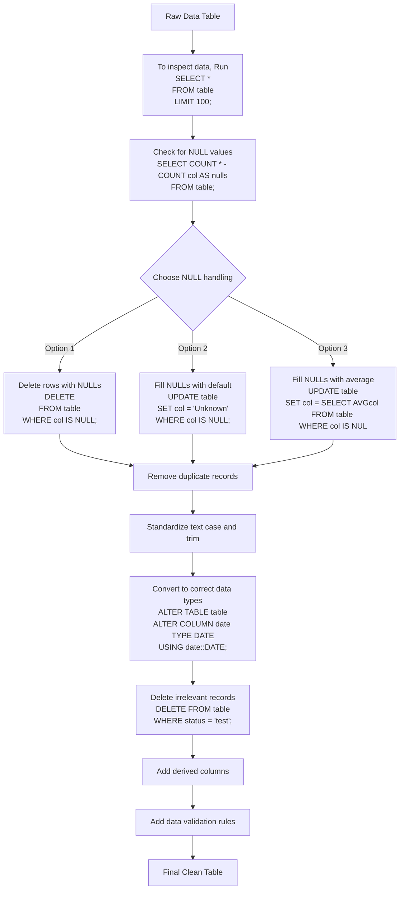

# Data Cleaning Flowchart on SQL

```mermaid
flowchart TD
    A[Raw Data Table] --> B[To inspect data, Run\nSELECT *\nFROM table\nLIMIT 100;]
    B --> C[Check for NULL values\nSELECT COUNT * - COUNT col AS nulls\nFROM table;]
    C --> D{Choose NULL handling}
    
    D -->|Option 1| E[Delete rows with NULLs\nDELETE\nFROM table\nWHERE col IS NULL;]
    D -->|Option 2| F[Fill NULLs with default\nUPDATE table\nSET col = 'Unknown'\nWHERE col IS NULL;]
    D -->|Option 3| G[Fill NULLs with average\nUPDATE table\nSET col = SELECT AVGcol FROM table \nWHERE col IS NUL]
    
    E --> H[Remove duplicate records]
    F --> H
    G --> H
    
    H --> I[Standardize text case and trim]
    I --> J[Convert to correct data types\nALTER TABLE table\nALTER COLUMN date TYPE DATE\nUSING date::DATE;]
    J --> K[Delete irrelevant records\nDELETE FROM table\nWHERE status = 'test';]
    K --> L[Add derived columns]
    L --> M[Add data validation rules]
    M --> N[Final Clean Table]
```
