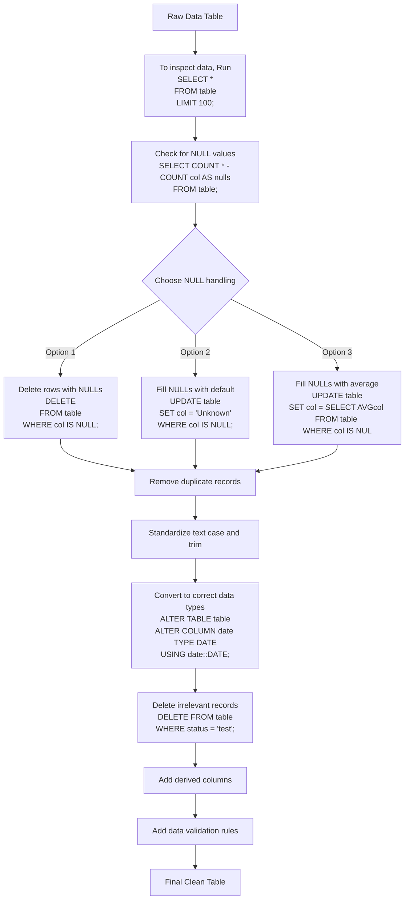

# Data Cleaning Flowchart on SQL

| Step | SQL Command Example |
|------|---------------------|
| 1. Raw Table | `SELECT * FROM raw_table;` |
| 2. Inspect Data | `SELECT * FROM table LIMIT 100;` |
| 3. Find NULLs | `SELECT COUNT(*) - COUNT(col) AS nulls FROM table;` |
| 4. Handle NULLs | `DELETE WHERE col IS NULL;` or `UPDATE SET col = 'Unknown';` |
| 5. Remove Duplicates | `DELETE FROM table USING (SELECT ... ROW_NUMBER() OVER(...))` |
| 6. Standardize Text | `UPDATE table SET name = UPPER(TRIM(name));` |
| 7. Convert Data Types | `ALTER TABLE table ALTER COLUMN date TYPE DATE;` |
| 8. Filter Rows | `DELETE FROM table WHERE status = 'test';` |
| 9. Add Calculated Columns | `ALTER TABLE table ADD COLUMN full_name TEXT;` |
| 10. Apply Constraints | `ALTER TABLE table ADD CHECK (age >= 0);` |
